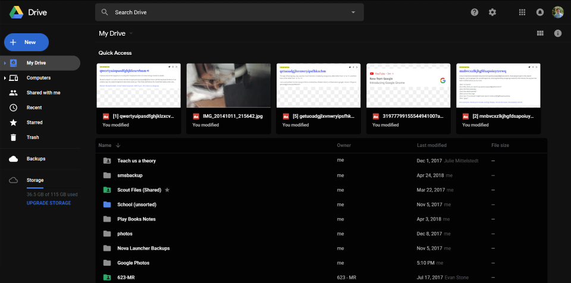

# Google Drive Dark 2018
This style adds a dark theme to the Google Drive webpage. It also makes slight modifications to the appearance of certain elements, including restoring the blue new button and adding mouse over effects for items.

There is also support for add-ons that add additional modifications (see bottom of description)

THIS STYLE REQUIRES THE NEW GOOGLE DRIVE

Currently themed:
- main page
- file list and cards
- quick access
- side navigation
- new file button
- context menus
- account switcher
- Google apps selector

Coming soon:
- details pane

Add-ons:
ADD-ON | Less Rounded Corners - Google Drive Dark 2018
ADD-ON | Custom Background - Google Drive Dark 2018
## Preview

## Installation

Install [Stylus](https://add0n.com/stylus.html) for either [Firefox](https://addons.mozilla.org/en-US/firefox/addon/styl-us/), [Chrome](https://chrome.google.com/webstore/detail/stylus/clngdbkpkpeebahjckkjfobafhncgmne) or [Opera](https://addons.opera.com/en-gb/extensions/details/stylus/) and then install the style using one of these methods:

📦 [Install the usercss](https://github.com/jackbuehner/google-drive-dark/raw/master/drive-dark.user.css) which supports automatic updates. 
📦 [Install from userstyles.org](https://userstyles.org/styles/160504) with customization, does not support automatic updates. 
📦 [Install manually from GitHub](https://github.com/jackbuehner/google-drive-dark/raw/master/drive-dark.css) with no customization, but useful for development. The style is in Mozilla format. 

If you would like to contribute to this repository, please...

1. Fork this repository
1. Make your changes
1. Create a pull request
